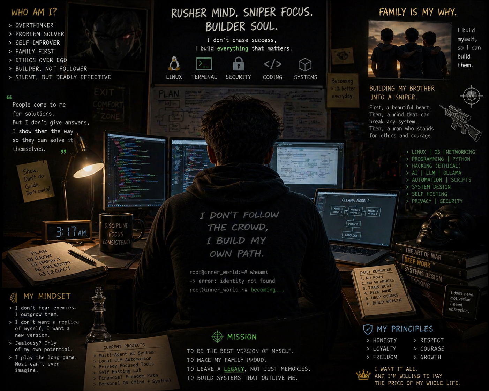
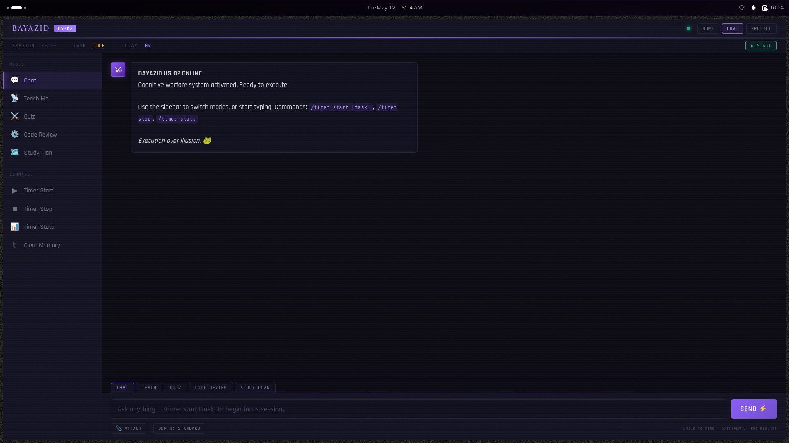

<div align="center">



# Marin Kitagawa HS-02

**Multi-Agent AI Personal Assistant — Local-First, Privacy-Driven, 100% Free**

*Built with FastAPI · LangGraph · Ollama · FAISS · SQLite*

---

[](https://python.org)
[](https://fastapi.tiangolo.com)
[](https://github.com/langchain-ai/langgraph)
[](https://ollama.ai)
[](LICENSE)

</div>

---

## What is this?

Marin Kitagawa HS-02 is a **fully local, multi-agent AI assistant** that runs on your machine. No API keys needed, no data leaves your system. It combines a personality-driven AI companion ("Marin") with 35+ integrated tools, a RAG knowledge base, games, and a full web dashboard.

### Core Philosophy

> *Execution over illusion.* Every tool call is real. Every graph is rendered. No faking output.

---

## Screenshots

<div align="center">

<br/>
<em>HS-02 Command Center — Chat, Teach Me, Quiz, Code Review, Study Plan</em>
</div>

<br/>

<div align="center">

<br/>
<em>System Architecture — Subprocess-isolated multi-process design</em>
</div>

---

## Features

### AI Engine
- **Marin Personality Engine** — INFJ/INTJ hybrid character with mood modifiers, emotional intelligence, and technical depth
- **LangGraph Agent** — Multi-step reasoning with tool execution (not just chat)
- **Two-Stage Intent Classifier** — Regex pre-filter (instant) + LLM tool binding via Pydantic schemas
- **Streaming Chat** — Real-time token-by-token responses via Ollama

### Tools (35+)
| Category | Tools |
|----------|-------|
| **Productivity** | Alarm, Timer, Email, Notes, Study Planner |
| **Knowledge** | RAG (FAISS + HuggingFace), Knowledge Hub, Wikipedia, News |
| **Finance** | Stock Data, Crypto Tracker |
| **Media** | YouTube Transcripts, Image Analysis (Leo), Drawing, PDF Tools |
| **Translation** | Google Translate, Deep Translator |
| **System** | App Launcher (80+ apps), Stealth Browser, Maps |
| **Fun** | Tic-Tac-Toe, Connect 4, Word Game, Jokes |

### Web Dashboard
- **Chat Mode** — Direct conversation with Marin
- **Teach Me Mode** — Structured learning sessions
- **Quiz Mode** — Auto-generated quizzes on any topic
- **Code Review Mode** — AI-powered code analysis
- **Study Plan Mode** — Custom study schedules
- **Knowledge Hub** — Location-based exploration with interactive maps
- **Research Hub** — Deep research with web scraping
- **Vault Explorer** — Encrypted personal data vault

### Architecture
- **FastAPI** backend with async streaming
- **SQLite** database (chat history, timers, notes, settings)
- **FAISS** vector store for RAG (PDF, DOCX, source code)
- **Ollama** for all LLM inference (Gemma, Qwen, etc.)
- **Subprocess isolation** — Each tool runs in its own OS process
- **Cross-platform** — Linux-native with platform guards

---

## Quick Start

### Prerequisites

- Python 3.10+
- [Ollama](https://ollama.ai) installed and running
- At least one Ollama model pulled

```bash
# Install Ollama (Linux)
curl -fsSL https://ollama.ai/install.sh | sh

# Pull models
ollama pull gemma4:31b-cloud    # Main model
ollama pull qwen2.5:0.5b        # Fast classifier
ollama pull leo                  # Vision model
```

### Installation

```bash
git clone https://github.com/BayazidHabibSiddikee/Marin_Kitagawa-v3.git
cd Marin_Kitagawa-v3
python -m venv .venv
source .venv/bin/activate
pip install -r requirements.txt
```

### Run

```bash
# Start the main server
python main.py

# Or start individually
python main.py              # Main app (port 5069)
python rag_server.py        # RAG server (port 5080)
python server.py            # MCP game server
```

Open **http://localhost:5069** in your browser.

---

## Project Structure

```
marin/
├── main.py                 # FastAPI host — routes, streaming, dashboard
├── marin.py                # Marin AI Engine — character, chat, RAG
├── marin_fier.py           # Two-stage intent classifier (regex + LLM)
├── langgraph_agent.py      # LangGraph agent with tool execution
├── config.py               # Constants, app launcher, platform config
├── database.py             # SQLite — chat history, timers, notes
├── rag_server.py           # Shared RAG server (FAISS + HuggingFace)
├── server.py               # MCP server for games
├── image.py                # Leo — vision/image analysis
├── classifier.py           # Legacy classifier (kept for compat)
│
├── tools/                  # 35+ standalone tool scripts
│   ├── alarm.py            ├── stock.py
│   ├── timer.py            ├── crypto.py
│   ├── email_tool.py       ├── knowledge_hub.py
│   ├── translate.py        ├── maps.py
│   ├── pdf.py              ├── news.py
│   ├── stealth_browser.py  ├── youtube_transcript.py
│   └── ...                 └── ...
│
├── games/                  # Interactive games
│   ├── tiktaktoe.py        # Tic-Tac-Toe
│   ├── connect4_ai.py      # Connect 4 (AI opponent)
│   └── wordgame.py         # Word guessing game
│
├── utils/                  # Shared utilities
│   ├── shared_logic.py     # Timer, user context, core logic
│   ├── tts.py              # Text-to-speech (pyttsx3, gTTS, piper)
│   ├── platform.py         # Cross-platform path helpers
│   └── agent_logic.py      # Agent state management
│
├── rag/                    # RAG pipeline
│   ├── loader.py           # Document loader (PDF, DOCX, TXT)
│   └── clean_docs.py       # Document preprocessing
│
├── templates/              # Jinja2 HTML templates
│   ├── index.html          # Command Center dashboard
│   ├── marin_chat.html     # Chat interface
│   ├── knowledge_hub.html  # Knowledge Hub with maps
│   ├── research_hub.html   # Research Hub
│   └── ...
│
├── static/                 # Static assets
│   └── generated/          # AI-generated images
│
├── moduleflow/             # Marin Universe - Module dependency graph
├── doc/                    # Document corpus for RAG
├── code/                   # Source code corpus for RAG
├── storage/                # Runtime data (DB, vibe state)
└── unique/                 # Vault data (encrypted)
```

---

## Configuration

Edit `settings.json`:

```json
{
  "models": {
    "default": "gemma4:31b-cloud",
    "fast": "qwen2.5:0.5b",
    "vision": "leo",
    "embedding": "all-MiniLM-L6-v2"
  },
  "server": {
    "host": "0.0.0.0",
    "port": 5069,
    "ollama_base_url": "http://localhost:11434"
  }
}
```

---

## Tech Stack

| Layer | Technology |
|-------|-----------|
| **LLM** | Ollama (Gemma, Qwen, Leo) |
| **Orchestration** | LangGraph + LangChain |
| **Framework** | FastAPI + Uvicorn |
| **Vector Store** | FAISS + HuggingFace Embeddings |
| **Database** | SQLite (with JSON migration) |
| **TTS** | Piper / pyttsx3 / gTTS |
| **Frontend** | Vanilla HTML/CSS/JS (Jinja2) |
| **Classifier** | Regex + Pydantic StructuredTool |

---

## License

MIT License — do whatever you want with it.

---

<div align="center">

**Built with discipline. Powered by obsession.**

*No API keys. No cloud. No compromise.*

</div>
>
