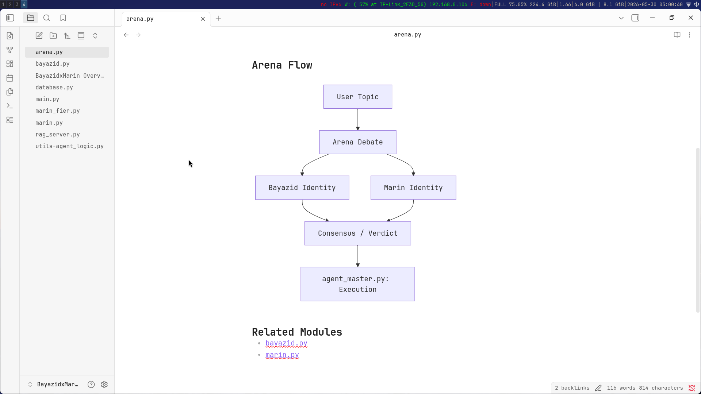
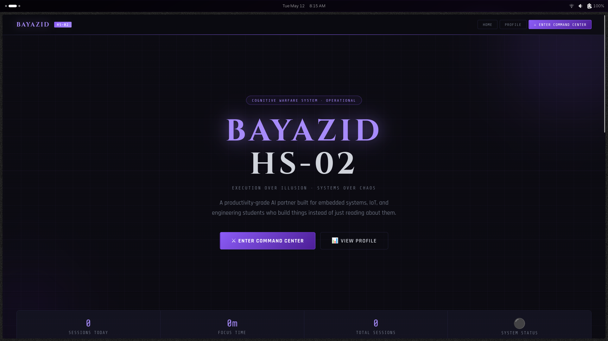
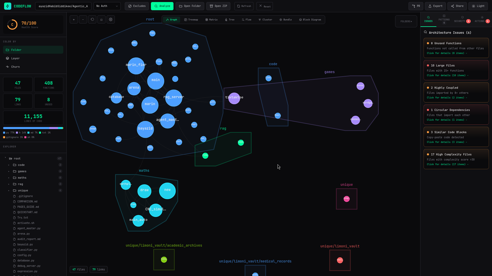
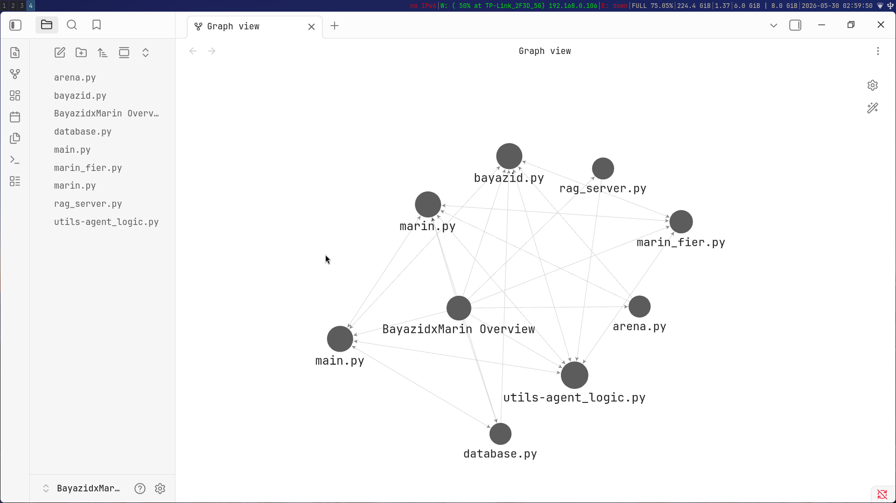
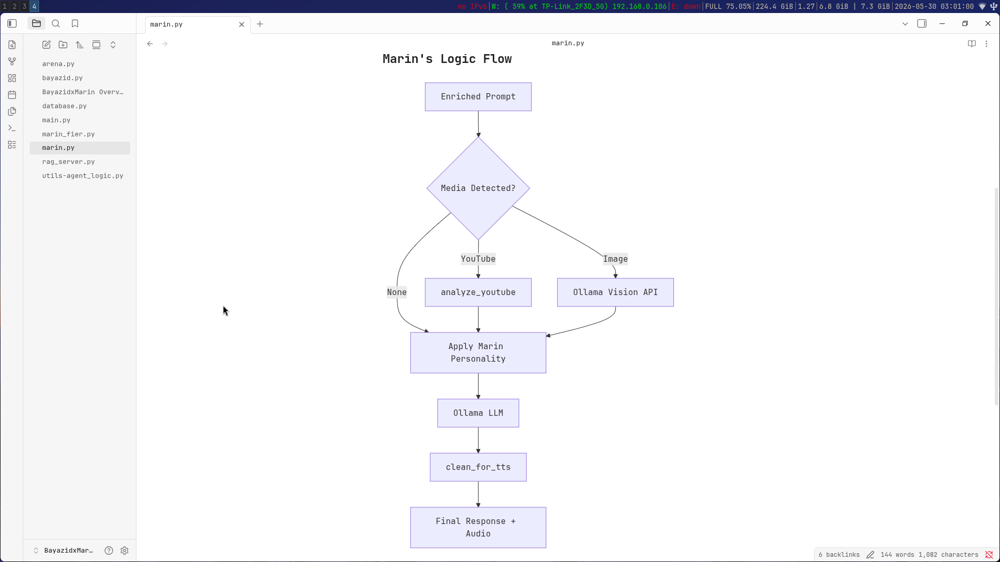
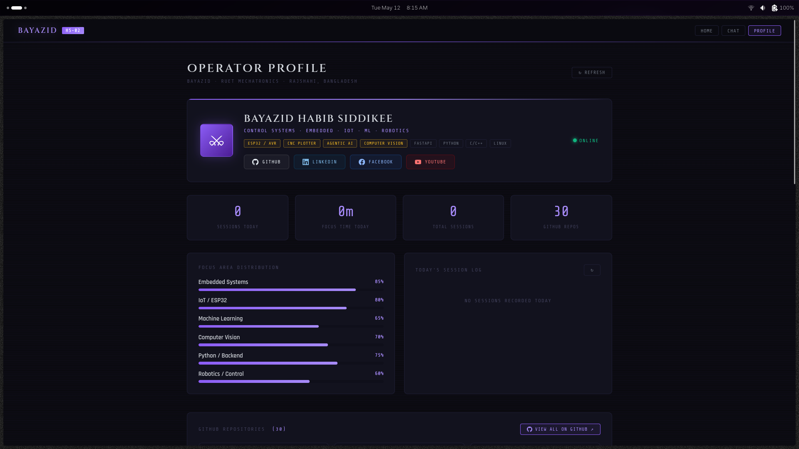

<p align="center">
  
</p>

<h1 align="center">SwordFish</h1>

<p align="center">
  <strong>The Cybernetic Sentinel & System Orchestrator</strong><br/>
  <em>A production-grade AI operating system built for high-stakes tool orchestration and technical intelligence.</em>
</p>

<p align="center">
  
  
  
  
  
</p>

---

## Overview

SwordFish is powered by the **Marin Cognitive Architecture** — a unified intent classifier and 4-node LangGraph cycle that ensures every tool call is verified, accurate, and safe. It merges local LLMs (Ollama) with cloud frontier models (OpenRouter) into a single, secure, user-isolated environment.

<p align="center">
  
</p>

---

## Core Capabilities

<table>
<tr>
<td width="50%">

### PDF Intelligence
Deep structural analysis, contextual Q&A, and citation-accurate research summaries from any document.

<p align="center">
  
</p>

</td>
<td width="50%">

### Chat Interface
Real-time streaming responses with Markdown, KaTeX math rendering, and multi-modal input support.

<p align="center">
  
</p>

</td>
</tr>
<tr>
<td>

### Study Engine
Autonomous mastery sequences — finds textbooks, generates roadmaps, and builds adaptive quizzes.

<p align="center">
  
</p>

</td>
<td>

### Code Flow
LangGraph-powered 4-node cognitive cycle: Strategist → Executor → Auditor → Persona.

<p align="center">
  
</p>

</td>
</tr>
</table>

---

## Security & Privacy

| Layer | Description |
|-------|-------------|
| **Isolated Sandbox** | All terminal operations run in a dedicated Docker container. Zero host-root access. |
| **Multi-User Isolation** | 100% per-user isolation for chat history, files, and vault storage. |
| **RBAC** | Role-Based Access Control for Owners, Trusted Users, and Guests. |
| **Sentinel Guard** | Built-in kill switch and progressive latency for guest users. |
| **Encrypted Vault** | Per-user encrypted storage for secrets, keys, and sensitive data. |

<p align="center">
  
</p>

---

## Knowledge Map

SwordFish maintains a persistent knowledge graph that maps relationships between concepts, documents, and research threads.

<p align="center">
  
</p>

---

## Quick Start

### Prerequisites
- Python 3.11+
- Docker & Docker Compose
- Ollama (local LLM runtime)
- An OpenRouter API key (for cloud model fallback)

### 1. Clone & Configure

```bash
git clone https://github.com/yourusername/marin.git
cd marin
cp .env.example .env
# Edit .env with your API keys
```

### 2. Launch Everything

```bash
./run_all.sh
```

This starts:
| Service | Port | Description |
|---------|------|-------------|
| Main App (FastAPI + VRM Viewer) | `5069` | Chat UI, VRM avatar, API endpoints |
| RAG Knowledge Base | `5080` | Vector search, document intelligence |
| ModuleFlow Visualizer | `5070` | Brain topology visualization |

### 3. Access

```
http://localhost:5069
```

Click the **avatar** button in the top bar to toggle the 3D VRM viewer with cozy room environment.

---

## Architecture

```
marin/
├── main.py                 # FastAPI entry point
├── langgraph_agent.py      # 4-node cognitive architecture
├── marin.py                # Core engine (security, preprocessing, streaming)
├── config.py               # Configuration (models, server, keys)
├── database.py             # SQLite (chat history, timers, trades)
├── proactive_engine.py     # Auto-initiated conversations
├── local_llm.py            # Ollama/OpenRouter LLM streaming
├── templates/
│   └── marin_chat.html     # Full VRM viewer + chat UI (client-side)
├── static/
│   ├── models/             # VRM avatar model
│   ├── animations/         # 18 Mixamo FBX animations
│   └── images/             # Avatars, profile, UI assets
├── utils/
│   ├── persona.py          # Character definition
│   ├── agent_logic.py      # Preprocessing, RAG, streaming
│   ├── security.py         # Command authorization
│   └── command_runner.py   # Shell execution
├── Dockerfile              # Container build
├── docker-compose.yml      # Service orchestration
└── supervisord.conf        # Process management
```

---

## Tech Stack

| Layer | Technology |
|-------|-----------|
| **Runtime** | Python 3.11, FastAPI, Uvicorn |
| **AI Core** | LangGraph, Ollama, OpenRouter |
| **Vector DB** | FAISS (local), ChromaDB |
| **3D Viewer** | Three.js r147, @pixiv/three-vrm v0.6 |
| **Database** | SQLite (WAL mode) |
| **Container** | Docker, Supervisord |
| **Frontend** | Vanilla JS, marked.js, KaTeX |

---

## License

MIT License (Free for Personal Use) | **Enterprise Support Available**

---

<p align="center">
  
  <br/>
  <em>Built with obsession by <strong>Bayazid HS</strong></em>
  <br/>
  <small>© 2025 SwordFish AI. All rights reserved.</small>
</p>
