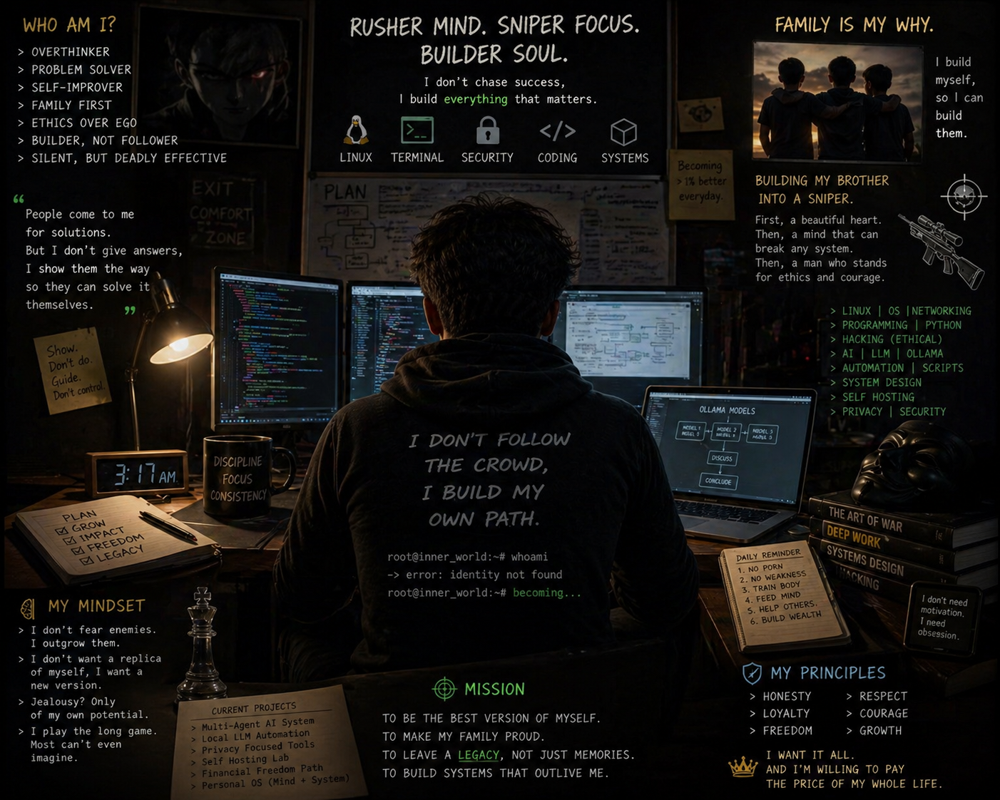
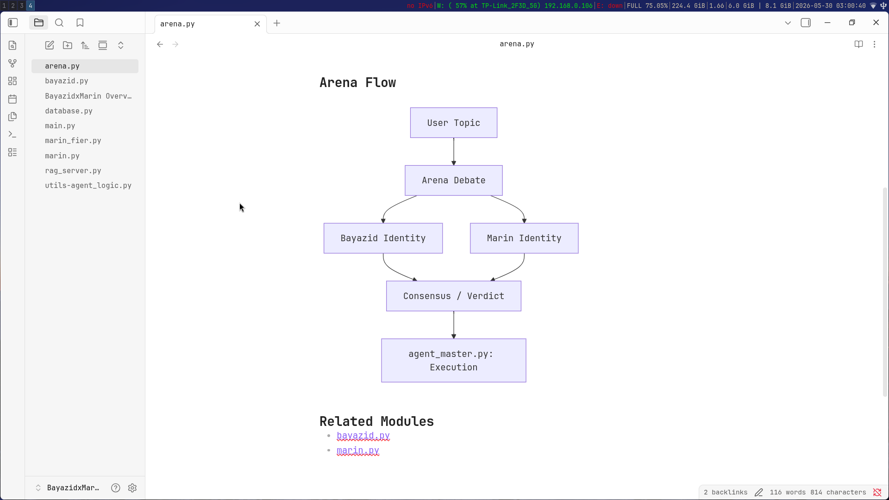
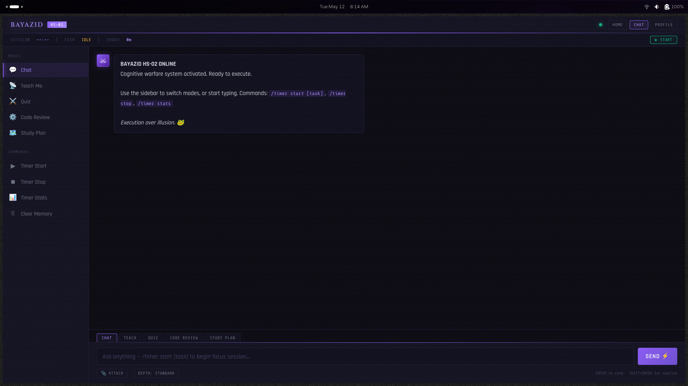
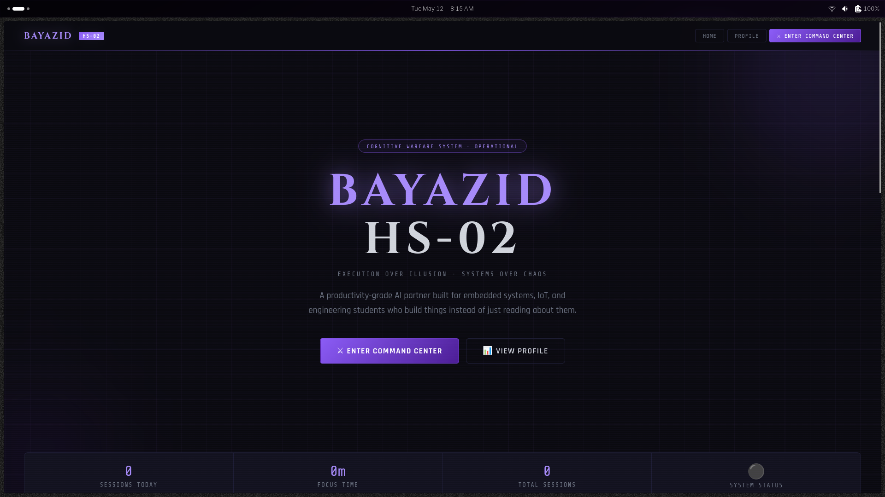
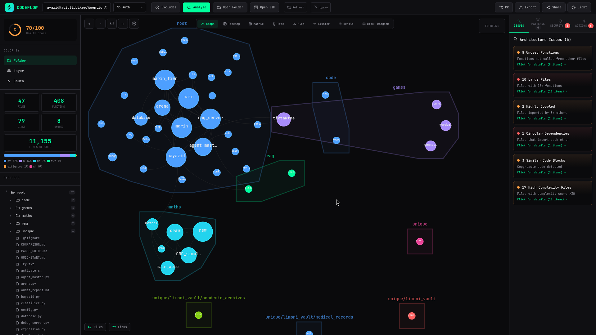
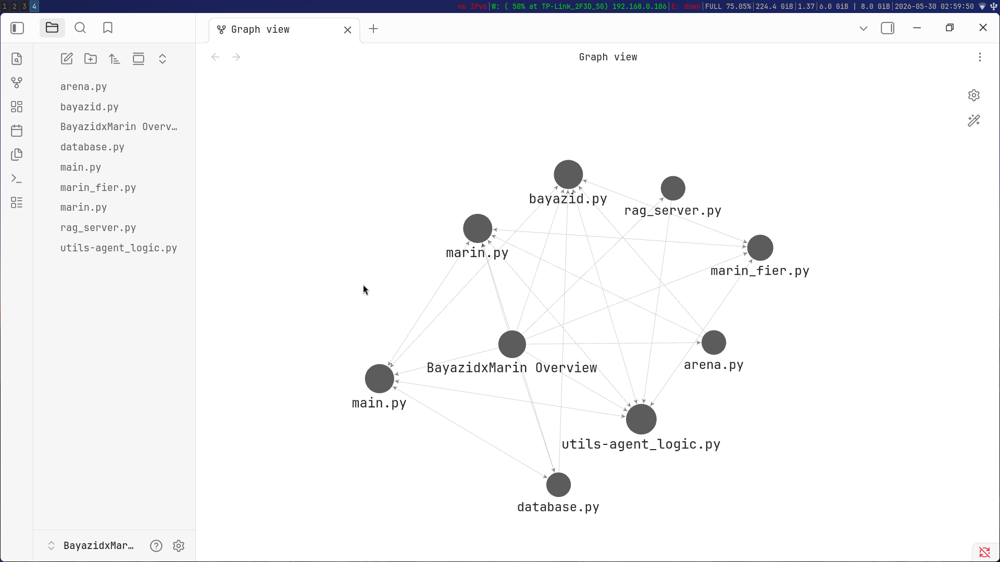
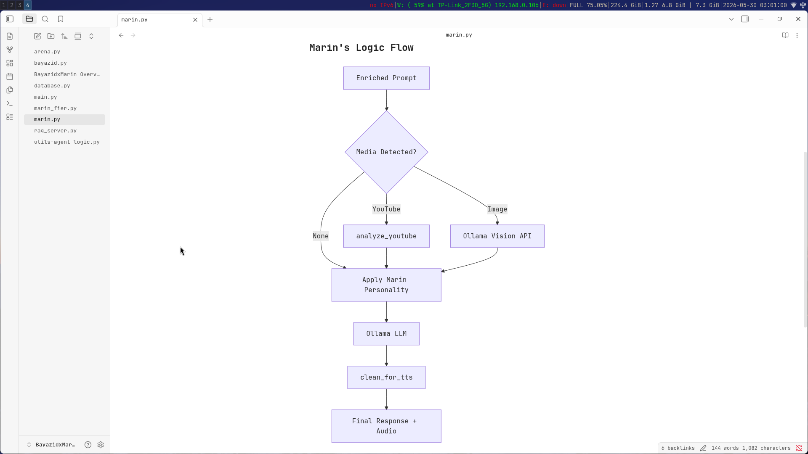
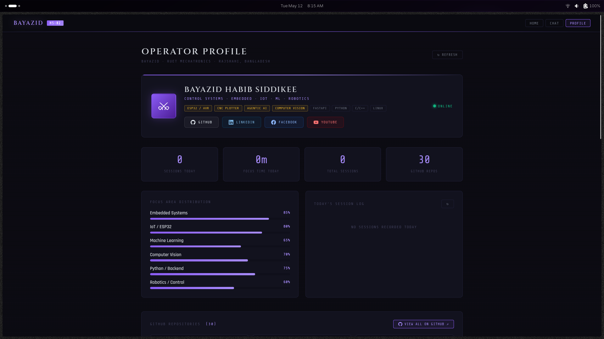

<p align="center">
  
</p>

<h1 align="center">SwordFish</h1>

<p align="center">
  <strong>The Cybernetic Sentinel & System Orchestrator</strong><br/>
  <em>A production-grade AI operating system built for high-stakes tool orchestration and technical intelligence.</em>
</p>

<p align="center">
  
  
  
  
  
  
  
</p>

---

## Overview

SwordFish is powered by the **Marin Cognitive Architecture** — a unified intent classifier and 4-node LangGraph cycle that ensures every tool call is verified, accurate, and safe. It merges local LLMs (Ollama) with cloud frontier models (OpenRouter) into a single, secure, user-isolated environment — and now includes a dual-agent coding layer via **opencode**.

```
User Input
    │
    ▼
┌─────────────────────────────────────────────┐
│            marin_fier  (Intent Router)       │
│  regex + ML classify → selects tool/intent  │
└──────────────┬──────────────────────────────┘
               │
               ▼
┌─────────────────────────────────────────────┐
│         LangGraph 4-Node Cycle               │
│                                             │
│  ┌──────────┐    ┌──────────┐               │
│  │Strategist│───▶│ Executor │               │
│  └──────────┘    └────┬─────┘               │
│        ▲              │ tool calls          │
│        │         ┌────▼─────┐               │
│  ┌─────┴────┐    │  Auditor │               │
│  │ Persona  │◀───│ (verify) │               │
│  └──────────┘    └──────────┘               │
└─────────────────────────────────────────────┘
               │
    ┌──────────┼──────────────┐
    ▼          ▼              ▼
26 Tools    RAG/FAISS    opencode agent
(terminal,  (vector      (MiMo free model
 telegram,   search,      for code tasks)
 finance,    documents)
 memory...)
```

---

## Cognitive Architecture

<p align="center">
  
</p>

The 4-node cycle runs on every request:

| Node | Role |
|------|------|
| **Strategist** | Decomposes the user's intent into a plan and selects which tools to invoke |
| **Executor** | Calls the tools with generated arguments, captures results |
| **Auditor** | Validates tool output, re-routes if hallucinated or incomplete |
| **Persona** | Wraps the final answer in Marin's voice, streams to the client |

---

## Core Capabilities

<table>
<tr>
<td width="50%">

### PDF Intelligence
Deep structural analysis, contextual Q&A, and citation-accurate research summaries from any document. Backed by a FAISS vector store with sentence-transformer embeddings.

<p align="center">
  
</p>

</td>
<td width="50%">

### Chat Interface
Real-time streaming responses with Markdown, KaTeX math rendering, and multi-modal input support. Features an ML-driven VRM Director that predicts and orchestrates 3D avatar animations in sync with speech output.

<p align="center">
  
</p>

</td>
</tr>
<tr>
<td>

### Study Engine
Autonomous mastery sequences — finds textbooks, generates roadmaps, and builds adaptive quizzes tailored to your knowledge gaps.

<p align="center">
  
</p>

</td>
<td>

### Code Flow
Dual-agent code generation: Marin orchestrates the plan, then delegates focused coding tasks to **opencode** (MiMo free model) as a headless sub-agent. Results stream back into the conversation.

<p align="center">
  
</p>

</td>
</tr>
</table>

---

## opencode Integration — Dual-Agent Coding

Marin uses `opencode` as a **specialist coding sub-agent**. When a coding task is detected, Marin can delegate it to opencode running headlessly in the background, then incorporates the result into its response.

```
You: "write me a Python script to parse my CSV and get column averages"
        │
        ▼
  marin_fier routes → opencode_tool
        │
        ▼
  opencode run --model opencode/mimo-v2.5-free "..."
        │
        ▼
  Returns generated code → Marin reviews and streams to you
```

**What it's used for:**
- Writing functions, scripts, and classes from natural language descriptions
- Fixing syntax errors or bugs in specific files
- Creating boilerplate for new projects
- Generating one-off utility scripts without polluting context

**Trigger phrases:**
> "use opencode to...", "write me a script that...", "write a function to...", "fix the syntax error in..."

**Model used:** `opencode/mimo-v2.5-free` — free tier, no API cost.
Other available free models: `opencode/deepseek-v4-flash-free`, `opencode/nemotron-3-ultra-free`

---

## Tool Arsenal — 26 Active Tools

```
┌─────────────────────────────────────────────────────────────────┐
│                    CORE TOOLS (always active)                   │
├──────────────────┬──────────────────┬───────────────────────────┤
│  timer_tool      │  weather_tool    │  map_tool                 │
│  terminal_tool   │  rag_search      │  learn_topic_tool         │
│  file_tool       │  web_search_tool │  news_tool                │
│  youtube_tool    │  plot_tool       │  office_tool              │
│  memory_tool     │  opencode_tool   │                           │
├──────────────────┴──────────────────┴───────────────────────────┤
│                  COMMUNICATION TOOLS                             │
├──────────────────┬──────────────────┬───────────────────────────┤
│  telegram_tool   │  email_tool      │                           │
├──────────────────┴──────────────────┴───────────────────────────┤
│                  FINANCE TOOLS                                   │
├──────────────────┬──────────────────┬───────────────────────────┤
│  crypto_tool     │  stock_tool      │  binance_tool             │
│  portfolio_tool  │  technical_anal. │  risk_manager             │
├──────────────────┴──────────────────┴───────────────────────────┤
│                  PRODUCTIVITY TOOLS                              │
├──────────────────┬──────────────────┬───────────────────────────┤
│  alarm_tool      │  habit_tool      │  pdf_tool                 │
│  book_tool       │  pdf_downloader  │                           │
└──────────────────┴──────────────────┴───────────────────────────┘
```

> **terminal_tool** runs in a Docker sandbox when the container is available, falls back to direct host execution (guarded by `safety.py`) when it's not.

---

## Security & Privacy

```
Request
   │
   ▼
┌─────────────────────────────────────┐
│  Sentinel Engine (API Gateway)      │
│  • Rate limiting per user           │
│  • JWT session validation           │
│  • RBAC role check (Owner/User/Guest│
└──────────────┬──────────────────────┘
               │
               ▼
┌─────────────────────────────────────┐
│  safety.py (Command Guard)          │
│  • Allowlist/denylist for shell cmds│
│  • Blocks rm -rf, curl exfil, etc.  │
└──────────────┬──────────────────────┘
               │
               ▼
┌─────────────────────────────────────┐
│  Docker Sandbox / Host Fallback     │
│  • Container: zero host-root access │
│  • Fallback: safety.py still guards │
└─────────────────────────────────────┘
```

| Layer | Description |
|-------|-------------|
| **Isolated Sandbox** | Terminal ops run in Docker. Falls back to guarded host execution if container is offline. |
| **Multi-User Isolation** | 100% per-user separation for chat history, files, and vault. |
| **RBAC** | Owner / Trusted User / Guest — progressively restricted access. |
| **Sentinel Guard** | Kill switch + progressive rate throttling for guest users. |
| **Encrypted Vault** | AES-encrypted per-user storage for secrets, API keys, and sensitive data. |

<p align="center">
  
</p>

---

## Knowledge & Memory

SwordFish maintains two types of persistent knowledge:

**RAG Knowledge Base** (port `5080`) — a FAISS vector store that indexes your documents, PDFs, and research threads. Marin queries it automatically on every relevant message.

**Memory Tool** — structured long-term memory stored in SQLite. Marin can remember facts, preferences, and context across sessions. Viewable and editable via Settings → Memory.

<p align="center">
  
</p>

---

## Services & Pages

| Service | Port | URL | Description |
|---------|------|-----|-------------|
| Main App | `5069` | `/` | Landing page |
| Chat UI | `5069` | `/chat` | Full chat interface with VRM avatar |
| Profile | `5069` | `/profile` | User settings, themes, memory, vault |
| Sentinel | `5069` | `/sentinel` | Admin dashboard (Owner only) |
| Architecture | `5069` | `/flowmap` | Interactive system graph |
| Log Viewer | `5069` | `/logs` | Live log viewer (23 log files) |
| PDF Library | `5069` | `/library` | Document manager + RAG uploader |
| Research Hub | `5069` | `/research` | Deep document Q&A |
| RAG Server | `5080` | — | Vector search backend |
| ModuleFlow | `5070` | — | Brain topology visualization |

---

## Quick Start

### Prerequisites
- Python 3.11+
- Docker & Docker Compose (optional, for sandboxed terminal)
- Ollama (local LLM runtime)
- An OpenRouter API key (for cloud model fallback)

### 1. Clone & Configure

```bash
git clone https://github.com/yourusername/marin.git
cd marin
cp .env.example .env
# Edit .env with your API keys
```

### 2. Launch Everything

```bash
./run_all.sh
```

### 3. Access

```
http://localhost:5069
```

Click the **avatar** button in the top bar to toggle the 3D VRM viewer.

### 4. Optional — Enable opencode (free coding sub-agent)

```bash
curl -fsSL https://opencode.ai/install | bash
# opencode is auto-detected at ~/.opencode/bin/opencode
# No config needed — uses mimo-v2.5-free (free tier) by default
```

---

## Architecture

```
marin/
├── main.py                    # FastAPI entry point — routes, pages, API
├── langgraph_agent.py         # 4-node cognitive cycle + 26 tool definitions
├── marin_fier.py              # Intent classifier (regex + ML routing)
├── marin.py                   # Core engine (security, preprocessing, streaming)
├── sentinel_engine.py         # API Gateway, Admin API, Ollama stream proxy
├── director_engine.py         # VRM Director (ML gesture prediction & timing)
├── train_marin_animation.py   # ML training — DistilRoBERTa gesture model
├── llm_manager.py             # LLM pool (Ollama + OpenRouter + fallback)
├── rag_server.py              # FAISS vector search server (port 5080)
├── config.py                  # Configuration (models, server, keys)
├── database.py                # SQLite — chat history, timers, memory, trades
├── proactive_engine.py        # Auto-initiated conversations & news digests
├── privilege_manager.py       # RBAC — Owner / User / Guest roles
├── vault.py                   # AES-encrypted per-user secret storage
├── safety.py                  # Shell command allowlist/denylist guard
├── local_llm.py               # Ollama/OpenRouter streaming wrapper
├── telegram_bot.py            # Telegram bot listener
│
├── tools/
│   ├── opencode_tool.py       # opencode sub-agent (MiMo free model)
│   ├── memory_tool.py         # Long-term memory CRUD
│   ├── telegram_tool.py       # Telegram message sender
│   ├── email_tool.py          # Gmail sender
│   ├── knowledge_hub.py       # RAG + PDF intelligence
│   ├── learn_workflow.py      # Study engine + quiz generator
│   ├── office_tools.py        # Docs, spreadsheets, presentations
│   ├── news_harvester.py      # News fetching + digest
│   ├── stock.py               # Stock price & analysis
│   ├── crypto.py              # Crypto price & market data
│   ├── binance_client_tool.py # Binance trading API
│   ├── technical_analysis.py  # TA indicators (RSI, MACD, etc.)
│   ├── risk_manager.py        # Position sizing & risk calc
│   ├── mathplot.py            # Matplotlib chart generation
│   ├── pdf_analyzer.py        # PDF structural analysis
│   ├── pdf_downloader.py      # PDF search & download
│   ├── book_downloader.py     # Textbook finder
│   ├── youtube_transcript.py  # YouTube transcript extraction
│   ├── timer.py               # Countdown timers
│   ├── alarm.py               # Scheduled alarms
│   ├── habit_store.py         # Habit tracking
│   └── playground.py          # Code execution sandbox
│
├── utils/
│   ├── command_runner.py      # Shell exec — Docker or host fallback
│   ├── agent_logic.py         # Preprocessing, RAG injection, streaming
│   ├── persona.py             # Marin's character + system prompt
│   ├── tool_registry.py       # Tool metadata for /api/tools
│   └── security.py            # Input sanitization
│
├── templates/
│   ├── marin_chat.html        # Chat UI — VRM, themes, memory, tool panel
│   ├── profile.html           # Settings — themes, memory, vault, credentials
│   ├── flowmap.html           # Interactive architecture graph
│   ├── logs.html              # Live log viewer
│   ├── library.html           # Document & chat history manager
│   ├── sentinel_dashboard.html# Admin panel
│   └── research_hub.html      # PDF Q&A interface
│
├── static/
│   ├── models/                # VRM avatar model (.vrm)
│   ├── animations/            # 18 Mixamo FBX animations
│   └── images/                # UI assets
│
├── storage/
│   ├── marin.db               # Main SQLite database (WAL mode)
│   ├── todos.db               # Task/todo storage
│   └── vault.enc              # Encrypted secrets
│
├── Dockerfile                 # Container build
├── docker-compose.yml         # Service orchestration
├── supervisord.conf           # Process manager config
└── run_all.sh                 # One-command startup
```

---

## Tech Stack

| Layer | Technology |
|-------|-----------|
| **Runtime** | Python 3.11, FastAPI, Uvicorn |
| **AI Orchestration** | LangGraph, 4-node cognitive cycle |
| **LLM Providers** | Ollama (local), OpenRouter (cloud), opencode/MiMo (coding) |
| **Intent Routing** | marin_fier — regex patterns + ML classifier |
| **ML Engine** | PyTorch, Transformers (DistilRoBERTa for gesture prediction) |
| **Vector DB** | FAISS (local), ChromaDB |
| **3D Avatar** | Three.js r147, @pixiv/three-vrm v0.6, 18 Mixamo animations |
| **Database** | SQLite (WAL mode) — chat, memory, trades, habits |
| **Security** | Docker sandbox, RBAC, AES vault, command safety guard |
| **Container** | Docker, Supervisord |
| **Frontend** | Vanilla JS, marked.js, KaTeX, 10 color themes |

---

## Color Themes

Settings → Themes. 10 built-in themes, applied instantly and persisted:

| Theme | Accent |
|-------|--------|
| Marin Default | Teal `#4db8a4` |
| Night Mode | Deep teal on pure black |
| Cyberpunk | Magenta `#ff00ff` |
| Solar Amber | Amber `#f0b429` |
| Crimson | Red `#ff4444` |
| Ice Blue | Sky `#4fc3f7` |
| Emerald | Green `#2ecc71` |
| Violet | Purple `#a855f7` |
| Rose Gold | Pink `#f43f5e` |
| Mono | Greyscale |

---

## License

MIT License (Free for Personal Use) | **Enterprise Support Available**

---

<p align="center">
  
  <br/>
  <em>Built with obsession by <strong>Bayazid HS</strong></em>
  <br/>
  <small>© 2025 SwordFish AI. All rights reserved.</small>
</p>
